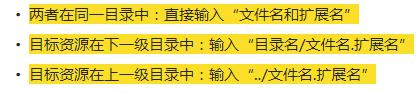

# 1. 基础概念
1. B/S和C/S是什么？优缺点？
2. 【重点】URL：[协议://]服务器地址[:端口号][/资源路径]
3. URI>URL   [协议://]服务器地址[:端口号][/资源路径][?参数1=值1&参数2=值2]#[片段]
4. 【重点】路径（绝对路径、相对路径、相对服务器路径）

5. 【掌握】MIME：  格式 ：一级类型/二级类型 image/png
6. 【面试】网页呈现过程
7. 【掌握】颜色、长度表示方法

# 2. HTML
1. 知识：超文本标记语言
2. HTML标记构成：开始标记、结束标记、属性、属性值、文本
3. HTML网页的构成：版本声明、html、head[title网页的标题]/body（结构标记）
4. 语法特点：
	1. HTML不需要编译，浏览器解释执行
	2. 标签不区分大小写，建议小写
	3. 不可见字符被解释为一个空白符
	4. 建议标签要正确嵌套
