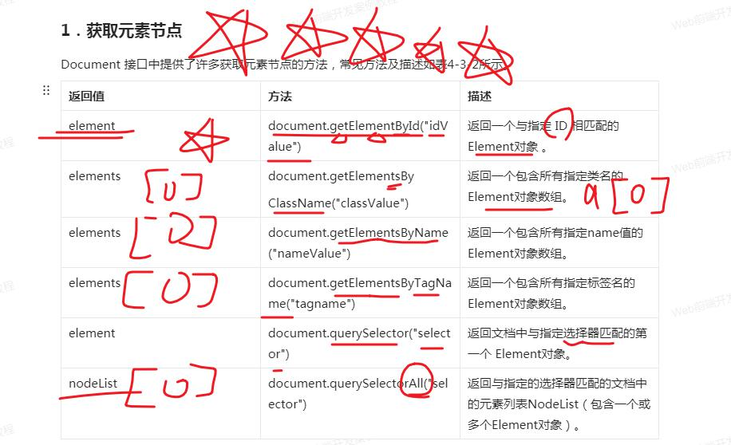

# 1. JavaScript介绍
1. JavaScript的构成？ ECMAScript、DOM、BOM
2. JavaScript的作用？ 通过事件响应来控制对象
3. JavaScript的特点？ 弱类型、基于原型、解释性、跨平台
4. JavaScript的语法特点？ 区分大小写...
5. JavaScript的使用？ 三种使用方法
6. JavaScript的输出：输出到控制台、输出到页面
# 2. 变量及声明
## 1. 变量声明
1. 声明的关键词 var  let
2. 变量的声明提升
## 2. 变量的类型
1. 布尔类型 注意：布尔类型和数字的转换； new Boolean()这种初始化的结果是对象
2. null
3. undefined
4. 数字 注意：0.1+0.2为什么不等于0.3？如何解决（保留第15位） infinity NaN
5. 字符串 注意：单双引号嵌套以及转移字符
6. 对象 {}
## 3. 类型判断
1. typeof x 判断x的类型
2. x instanceof y 判断x是否是y的实例
# 3. 运算和语法结构
1. "+" 在操作数一端是字符串时，表示字符串拼接
2. "-" 将操作数转换为数字，再运算，如果不能转换，不能运算 NaN
3. "=="和"==="的区别
# 4. 类型转换
1. 将类型转换为数字
	Number() 解析parseInt() 减0
2. 将类型转换为字符串
	String() x.toString() +""
3. 将类型转换为布尔
	Boolean()
	
# 5. 函数
## 1. 函数的声明
1. function fun(a,b,c){}
2. var/let fun = function(a,b,c){}
## 2. 函数的调用
1. fun()
2. 事件响应

# 6. 常用对象[重要]
## 1. element 元素
1. 查

2. 改