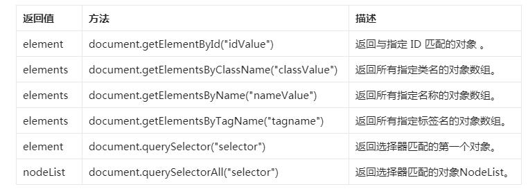

# 1. Element元素 HTML
## 1. 查询（重要，考试必考）
1. 6种方法（五颗星）

## 2. 修改
1. 文本 innerHTML  innerText（重要）
	1. 得到文本
	2. 修改文本
2. 属性（全局id/class/title/style/ input--value、一般属性）
	1. 值  x.value  x.id  x.class  x.style.color="red"
		扩展：计算器
			1. 字符串--> 数字  Number() 减0  parseInt parseFloat
			2. 0.1+0.2!=0.3
			3. 除数不能为0
			4. 输入内容不是数字？
	2. 属性（一般） 特别地，如果修改的属性是style，可以来控制CSS
		1. 增 x.setAttribute("属性名","属性值")
		2. 删 x.removeAttribute("属性名")
		3. 改 x.setAttribute("属性名","属性值")
		4. 查 x.getAttribute("属性名")
## 3. 增加（DOM）
## 4. 删除（DOM）

# 2. 数组
1. 数组如何初始化？ var a=[]
2. 常用属性？ length   如果长度设置为0，表示清空数组
3. 常用方法
	1. 数组元素连接
	2. 数组元素增删（头部、尾部）
	3. 数组元素排序和逆序
	4. 数组-->字符串 join()  toLocalString()

# 3. 字符串
1. String和string的区别？
2. 字符串的属性  length
3. 字符串常用方法
	1. 字符--索引 indexOf(char) x[index] 
	2. 字符串截取 substring() substr()
	3. 字符串-->数组 split()
扩展：自定义对象
1. 对象初始化  var obj={}
2. 对象属性操作 obj.name = 属性值  obj["属性"]=属性值

# 4. Math对象
1. 常用 Math.PI
2. 常用方法
	1. 三角函数
	2. 幂函数、根号
	3. 数值处理（取整）
	4. 随机函数 [0,1)  [0,n] [m,n]

# 5. Date对象
1. 初始化（当前日期/指定日期）
2. 获取日期数据（年月日时分秒 星期）
3. 生成时间戳（防止浏览器缓存）