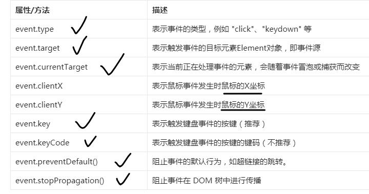

# 1. 事件的组成（了解）
1. 事件源（按钮）
2. 事件（click）【重点】
3. 事件处理程序（函数）
# 2. 事件处理程序的调用方法【掌握】
1. 方法1：直接在HTML标签中调用  ```<button onclick="fun1(),fun2()"></button>```
		缺点：在大量事件处理的时候，不易于维护，事件处理和HTML混在一起
		优点：简单、明了
2. 方法2：为事件源的对应事件属性添加函数 
	1. 获得事件源e（6种）
	2. e.onclick = fun1; e.onclick = fun2;（会覆盖掉fun1）
		缺点：只能够触发一个函数
		优点：简单、明了
3. 方法3：为事件源添加事件监听器
	1. 获得事件源e（6种）
	2. e.addEventListener('click', fun1 [,是否使用捕获型false]);
	   e.addEventListener('click', fun2 [,是否使用捕获型false]);
	优点：灵活添加事件、灵活地控制事件模型、灵活地移除事件
		e.removeEventListener('click', fun1 [,是否使用捕获型false]);
# 3. 事件模型
1. 事件模型有哪些？ 捕获型  冒泡型（默认）
2. 事件传播顺序？  根节点-（捕获阶段）-子节点（目标阶段）-（冒泡阶段）-根节点
3. 【重点】事件对象event

	1. event.target  event.currentTarget
	2. event.type
	3. 阻止事件传播
# 4. JS事件
1. 鼠标事件
	1. 单击 click
	2. 双击 dblclick
	3. 移入移出
	4. 悬停离开
2. 键盘事件
	1. keypress
3. 表单事件
	1. change
	2. submit【重要：表单验证】
		1. 验证非空   ==""
		2. 验证长度   v.length<6
		3. 验证是否是数字  isNaN(v)
		4. 验证是否符合要求 正则表达式 
		 /[A-Z]/.test(pwd) && /[a-z]/.test(pwd) && /\d/.test(pwd) && /[\.@#!\$]/.test(pwd)
		5. 阻止提交 <form onsubmit="return fun()"></form>
			function fun(){ return false;}
4. 窗口事件
	1. load（自动运行代码；等待资源然后进行处理，处理代码可以放在此处）